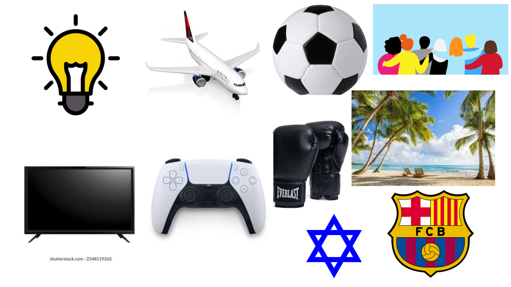

# me-in-markdown
Hi, my name is **Ethan Bass**, and I am a 10th grader at *Chatsworth Charter High School.* I like to play soccer, and I play on the high school team. My favorite movie is probably 72 Hours. I liked it because it was really funny. Some new knowledge I recently learned is about history. I started taking notes in my history class, so I learned something new in that class. I have also accomplished some things recently. First of all, I was able to get a 4.0 in school last year. This took a lot of hard work. Also, I passed my computer science AP test with a 4. I was very proud of this because this class was difficult. Finally, I got on the soccer team, which is very cool.
  
Playing soccer and other sports are my favorite hobbies. I have been playing soccer since I was very young, and I always enjoyed it. Also, I have trained in martial arts for a long time, which I also always loved doing. There are many goals I have set myself for this year. I would like to accomplish getting over a 4.0 GPA. Also, I would like to pass all my <u>AP classes</u> with a 4 or higher. In addition, I would like to get a lot better at soccer. There is always room for improvement. Over the summer, I traveled to Hawaii. It was amazing and I had a great time. I went with my friend and his family, and we made great memories. 

In the future, there are some things I would like to do. The goal is to be a professional soccer player. This has always been a dream of mine, and making it come true would be amazing. It will take a lot of hard work and dedication, but it is possible. Also, I would like to get into sports medicine. I had to go to physical therapy for a while because of some injuries, and I liked what they did. I thought it was really cool how they knew how to target every muscle and be able to train it to be stronger. Both of these things are something I really hope I can achieve in the future. So, my 2 goals for the future are:
1. professional soccer player
2. Physcial therapist

[playlist of my favorite songs](https://open.spotify.com/playlist/5wV8gdzCL47KlL7Jf5BWfw?si=t7ZPDUTwSy6kaEAtAfTGWA&utm_source=copy-link)
